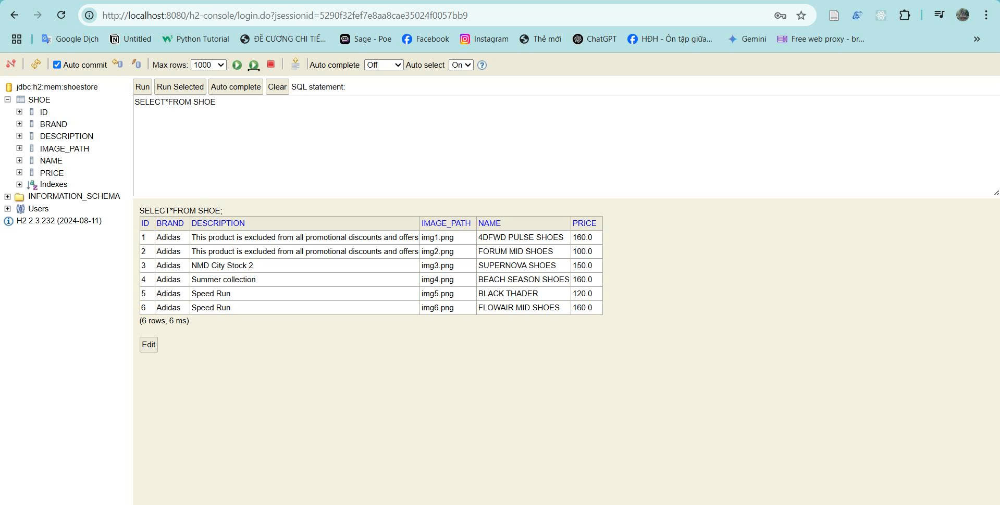

# Java-IE303-BTTH4

## Shoe Store API - Spring Boot

### Hệ thống cần có:

- JDK 17+
- Maven 3.8+
- Git

### Chạy dự án

#### 1. Clone dự án

```bash
git clone -b lab4 https://github.com/ManGia44/Java-IE303.git
cd Java-IE303
```

#### 2. Khởi chạy ứng dụng

```bash
mvn spring-boot:run
```

#### 3. Truy cập ứng dụng

- **API Endpoint:** [http://localhost:8080/api/shoes](http://localhost:8080/api/shoes)
- **H2 Console:** [http://localhost:8080/h2-console](http://localhost:8080/h2-console)

  - **JDBC URL:** `jdbc:h2:mem:shoestore`
  - **Username:** `user`
  - **Password:** `123456`

  

### Demo kết quả

#### 1. Kết quả API


#### 2. Giao diện H2 Console



### Lưu ý

- Ứng dụng tự động tạo database và thêm dữ liệu mẫu khi khởi động
- Dữ liệu sẽ mất khi tắt ứng dụng (do dùng H2 in-memory)
